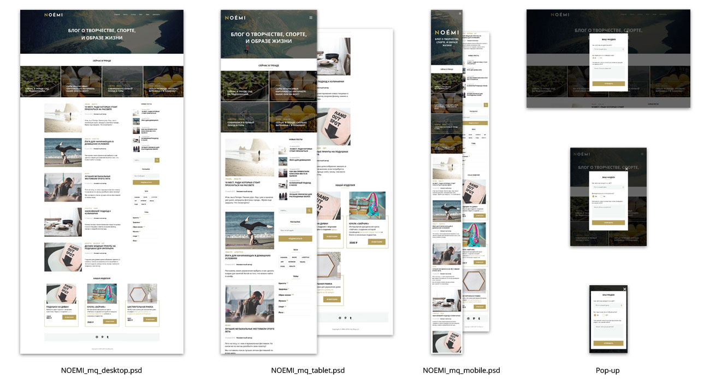

# Курсовой проект курса «HTML и CSS: основы веб-верстки»

## Цель

Сверстать адаптивные макеты сайта для устройств:

1. Мобильные (mobile)
2. Планшеты (tablet)
3. Стационарные (desktop)

Макеты выглядят так:

## Зачем?

1. Закрепите навыки работы с Git и Github
2. Разработаете с нуля проект, который можно добавить в своё портфолио
3. Закрепите знания адаптивной вёрстки

## Необходимые инструменты

1. Git и GitHub
2. Photoshop
3. Ваш любимый текстовый редактор (Visual Studio Code, если вы ничего не любите)

## Этапы сдачи проекта

Работа сдаётся поэтапно

1. Готовая desktop-версия сайта (без медиазапросов)
2. Адаптивная версия сайта (mobile+tablet)

## Исходные файлы

1. PSD-макеты в папке [./sources/psd](./sources/psd)
2. JPG версии макетов для быстрого просмотра в папке [./sources/preview](./sources/preview/)
3. Фоновые и контентные изображения в [./sources/img](./sources/img/)
4. Файлы шрифтов папке [./sources/fonts](./sources/fonts/)
5. SVG-иконки в папке [./sources/svg](./sources/svg/)

## Критерии зачёта

1. Макет опубликован на [GitHub Pages](https://pages.github.com/). 
2. Работа выполнена в соответствие с [требованиями](#requirements)

## Требования

1. [Этап 1. Стационарная версия](./requirements_step-1.md)
2. [Этап 2. Адаптивная версия + всплывающая форма](./requirements_step-2.md)

## Рекомендации

1. Для кроссбраузерной вёрстки используйте библиотеку [normalize.css](./https://necolas.github.io/normalize.css/)
2. Для упрощения работы, уменьшения повторов кода рекомендуется использовать методологию БЭМ
3. При выполнении второго этапа рекомендуется использовать подход Mobile First
4. Чтобы выдержать точное соответствие макету, вы можете использовать подход по Pixel Perfect